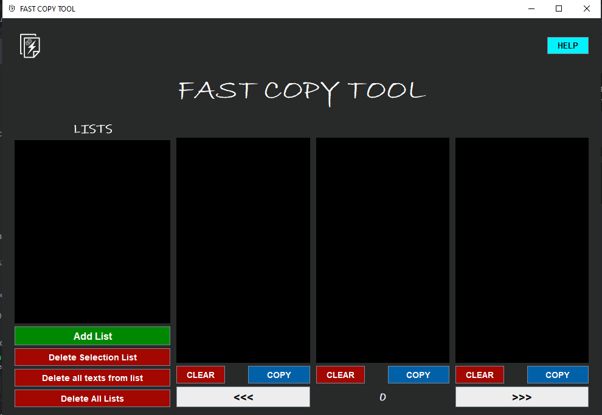
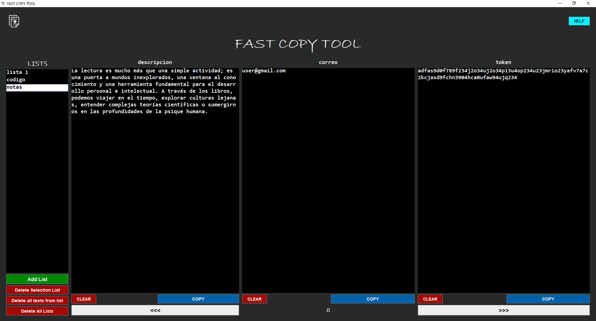
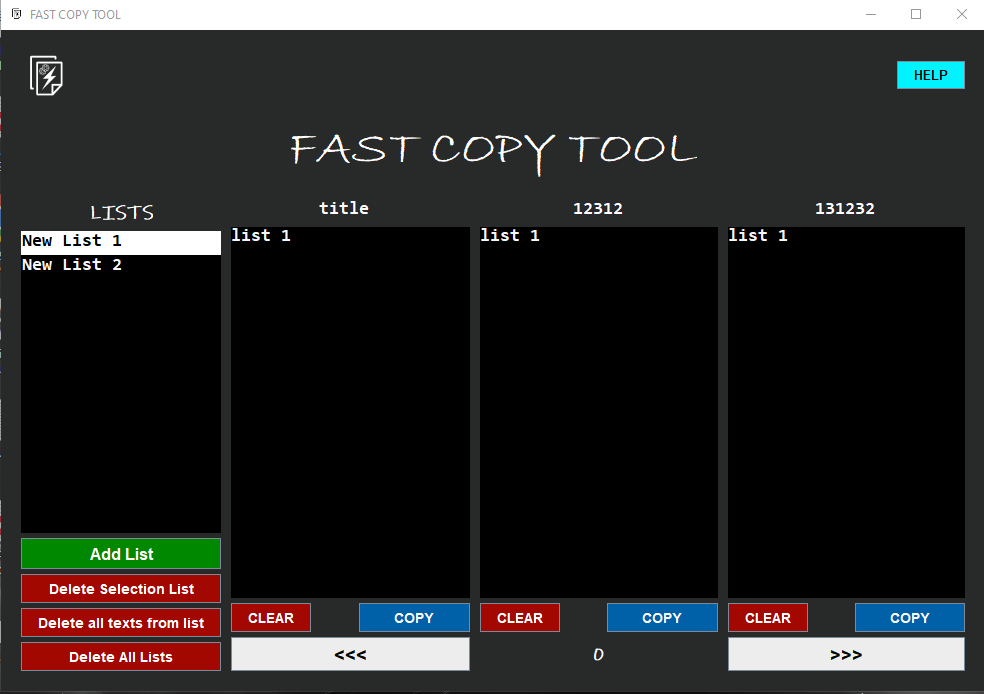
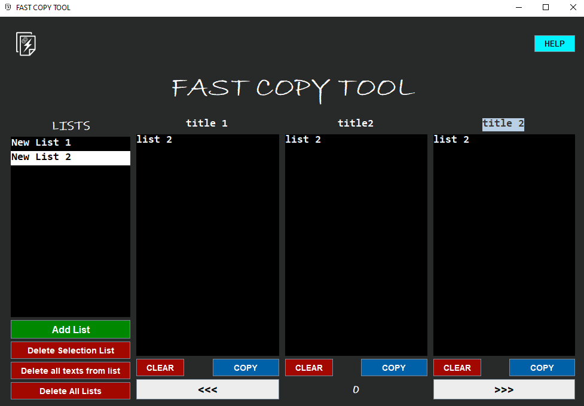

# FastCopyTool - Documentation

## [Download in Github](https://github.com/JuanGuzmanG/FastCopyToolApp/archive/refs/heads/main.zip)
to use, it is recommended to save the folder in “Documents” or a folder that allows reading and writing because it creates a .bin file that stores the data of the lists and texts that you save. you can also create a shortcut.

### About 
Fast Copy Tool is a simple program that saves texts, create lists. you can easily copy them later.

### User Guide: Step by Step
1. Create a list with the "add list" button and add a name to the list or use the default one.
2. Add the texts you want to save.
3. If you want, you can add titles to each text.
4. Copy the desired text with the "copy" button.
5. You can clear the text area with the "clear" button.
6. Lists and texts are saved automatically, there is no problem closing the software or shut out your computer.
7. You can save 9 blocks of texts per list, navigate between them with the index.

## Objective
- Save different texts which can be easily copied when needed.
  ### Secondary objetives 
  - Separate texts by lists for better order
  - Put titles to identify what the text contains

## Main window

## Addlist window

## List 1 created

## List 2 created

